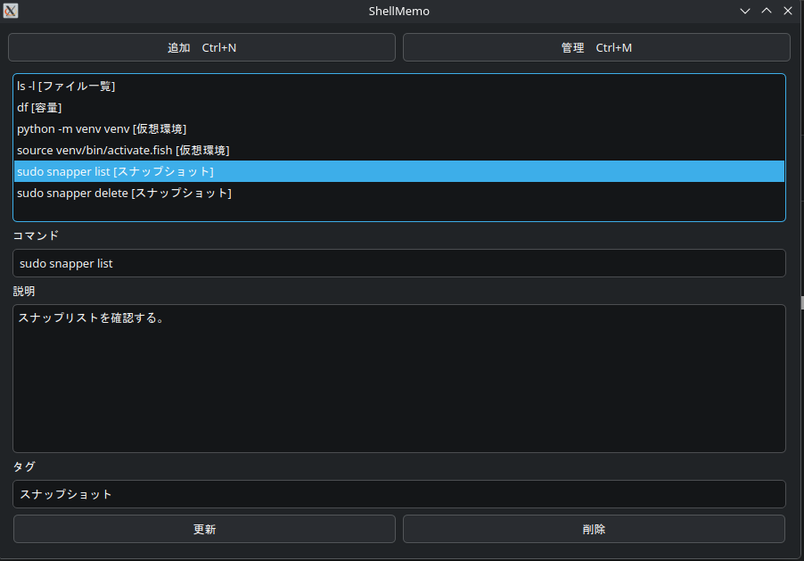

# ShellMemo AI

> コマンド、もうググらない

Linuxコマンドを「覚えずに使える」ツール

---

## ✨ 特徴

- コマンドを登録・管理
- タグで検索
- ドラッグで並び替え
- AI検索（日本語OK）
- GPTでコマンド生成
- ワンクリックコピー

---

## 🧠 できること

例：

- 「バッテリーの状態を確認したい」
→ `upower -i $(upower -e | grep BAT)`

- 「ディスク容量を確認したい」
→ `df -h`

---

## 🚀 ダウンロード
https://github.com/MtTakao599/shellmemo-ai/releases

---

## 📸 スクリーンショット




---

## ▶ 使い方

```bash
chmod +x ShellMemo-AI-v1.0.AppImage
./ShellMemo-AI-v1.0.AppImage
